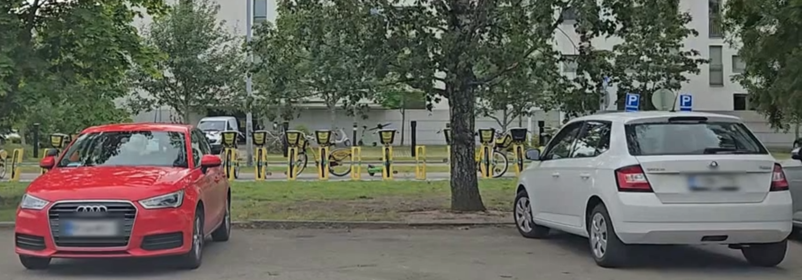

# video-privacy-blur

Blur **license plates** and/or **faces** in videos with a single command.
Uses Ultralytics YOLO for detection and OpenCV for blurring.

## Features
- CPU / GPU / Apple MPS selection (`--device cpu|cuda|mps|auto`)
- Toggle plates and/or faces independently
- Two anonymization styles: **gaussian** blur or **pixelation**
- Works on files or webcams
- Minimal deps, no manual plate weights required

A sample test video showing blurred faces and license plates can be viewed here:
[Privacy Blur Demo YouTube](https://youtu.be/2lWWn4ubX78)




## Models

To run the tool, you need to download the following YOLOv8 models and place them in the `models/` folder:

- **Face detection model:** `yolov8n-face.pt`
  - Downloaded from [akanametov/yolo-face](https://github.com/akanametov/yolo-face)
  - Used to detect human faces with YOLOv8.
  - Can be replaced with any YOLOv8 face model you prefer.

- **License plate detection model:** `license_plate_detector.pt`
  - Downloaded from [Muhammad-Zeerak-Khan/Automatic-License-Plate-Recognition-using-YOLOv8](https://github.com/Muhammad-Zeerak-Khan/Automatic-License-Plate-Recognition-using-YOLOv8)
  - Used to detect vehicle license plates with YOLOv8.
  - Can be swapped with any YOLOv8 license plate detector model you have trained or obtained.


## Quickstart

```bash
git clone git@github.com:MengWoods/video-privacy-blur.git
cd video-privacy-blur
# Crate a virtual Python environment
python3 -m venv .venv && source .venv/bin/activate
pip install -r requirements.txt
# Enable the privacy-blur CLI in editable mode
pip install -e .
```

### Run

```bash
# Plates and faces, Gaussian blur
privacy-blur --plate-weights models/license_plate_detector.pt \
             --face-detector yolo \
             --face-yolo-weights models/yolov8n-face.pt \
             --input input.mp4 --output out.mp4 --device auto --show

# Only plates
privacy-blur --plate-weights models/license_plate_detector.pt \
             --no-blur-faces \
             --input input.mp4 --output plates_only.mp4
```

### Examples

```bash
# Plates only, gaussian blur (default)
privacy-blur --input dashcam.mp4 --no-blur-faces

# Faces only, pixelate on GPU
privacy-blur --input street.mp4 --no-blur-plates --method pixelate --device cuda

# Use YOLO face model instead of Haar (better on varied angles)
privacy-blur --input crowd.mp4 --face-detector yolo --face-yolo-weights models/yolov8n-face.pt


### CLI Options

```bash
--input: path to video or camera index (0, 1, …)
--output: output video path (default out_blurred.mp4)
--device: auto (default), cpu, cuda, or mps
--imgsz: YOLO inference size (default 960)
--conf: YOLO confidence threshold (default 0.35)
--scale: expand boxes to ensure full coverage (default 1.35)
--show: show preview window
--blur-plates / --no-blur-plates: toggle plate blur
--blur-faces / --no-blur-faces: toggle face blur
--face-detector: haar (default) or yolo
--face-yolo-weights: local file or Ultralytics hub id
--plate-weights: local file for license plate model
--method: gaussian (default) or pixelate
--blur-strength: blur kernel divisor for gaussian (lower = stronger blur)
--pixelate-blocks: block count for pixelation (lower = stronger pixelation)
```

### Notes

- **GPU:** Only YOLO models use GPU. Haar face detection is CPU-only.
- **Weights:**
  - Plates: supply `--plate-weights` (e.g., `models/license_plate_detector.pt`).
  - Faces (YOLO): supply `--face-yolo-weights` (e.g., `models/yolov8n-face.pt`).
- **Performance:**
  - Lower `--imgsz` for faster speed; raise for accuracy.
  - Increase `--conf` to reduce false positives.
  - Tweak `--scale` if edges of plates/faces are not fully covered.
- **Privacy:**
  - Pixelation generally offers stronger privacy than light Gaussian blur.
  - For maximum anonymity, use large pixel blocks (`--pixelate-blocks 8–12`) or low blur divisor (`--blur-strength 4–6`).
